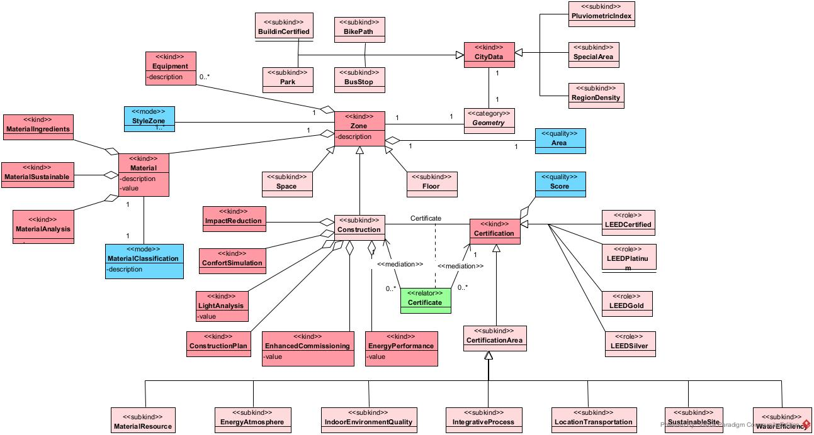

# SEBIM (Semantic BIM)
<b>Arcabouço conceitual para automação da certificação LEED</b>

A avaliação de projetos construtivos sustentáveis objetiva mensurar o desempenho em sustentabilidade dos ambientes construídos e é importante para melhorar o meio ambiente em crescente deterioração. No entanto, a maioria das tarefas de avaliação ainda é realizada manualmente, consumindo tempo e aumentando o risco de erros. Na construção civil, tem-se a tecnologia BIM (<i>Building Information Modeling</i>), usada para simular um empreendimento em seu ciclo de vida. Diante do crescente uso desta tecnologia, surge a oportunidade de utilizar seus dados e relacionar a outros conjuntos de dados, para analisar diferentes aspectos do projeto. O emprego de tecnologias semânticas é uma alternativa para integrar dados e realizar inferências no processo de tomada de decisões. Em um fluxo de trabalho integrado, mediado por ontologias, o mapeamento entre os elementos da construção e outros dados pode auxiliar na análise de especialistas. Este trabalho apresenta o desenvolvimento de um arcabouço conceitual, com o apoio em tecnologias semânticas, para estabelecer a relação entre os dados BIM e outros dados para automação da avaliação para certificação LEED (<i>Leadership in Energy and Environmental Design</i>). O processo para a implementação do artefato aplica a <i>Design Science Reseach</i> e se inicia com a obtenção do arquivo no formato IFC (<i>Industry Foundation Classes</i>) de um projeto desenvolvido em BIM. A ontologia ifcOWL, baseada no formato IFC, é extensa e diferente das ontologias existentes em vários outros domínios, que geralmente têm escopo mais restrito e dependem de extensões ativadas por princípios de dados vinculados. A implementação da ontologia deste trabalho contempla os requisitos gerais da linguagem de modelagem conceitual OntoUML, fundamentada na ontologia UFO (<i>Unified Foundational Ontology</i>). A ontologia SEBIM buscar modelar relações mais complexas contemplando classes para organizar os materiais e as zonas de um ambiente construído, bem como os critérios a serem pontuados. Para a integração com dados externos ao ambiente construído, dados abertos sobre o entorno e os meios de transporte são obtidos no site da prefeitura de Belo Horizonte. Estes conjuntos de dados tabulares contêm coordenadas geométricas de áreas e pontos da cidade, seguindo padronização da OGC (Open Geospatial Consortium). Uma vez selecionados os conjuntos de dados relevantes para esta pesquisa, os dados são mapeados em ontologias e anotados semanticamente, seguindo a abordagem de Dicionário Semântico de Dados (SDD - <i>Semantic Data Dictionary</i>) para conversão em RDF (<i>Resource Description Framework</i>). O grafo RDF é gerado contendo a formalização dos dados e favorecendo a integração para consulta sobre locais da cidade por dados espaciais. Os conjuntos de dados são inseridos em um triplestore para realização inferências em SPARQL, geradas por meio da conversão dos critérios para avaliação da certificação em consultas e inserção das novas triplas inferidas no conjunto de dados. Uma consulta final é realizada para apresentar o resultado das inferências para promover novo conhecimento aos especialistas. O artefato desenvolvido é verificado com experimentações e validado conforme as questões de competências referentes aos critérios de certificação. Os resultados mostraram que a aplicação destas tecnologias promove a extensão semântica dos elementos construtivos em BIM, facilita a integração com outras bases de conhecimento e organiza conceitualmente os dados para melhor recuperar informações. As inferências desenvolvidas podem ser consideradas em outros estudos que buscam relacionar e integrar dados para descoberta de novas correlações e criação de novos conhecimentos em aplicativos baseados em dados. 

<b>Ontologia em OntoUML</b>

<b>Ferramentas utilizadas:</b>

Anotação semântica de dados: <a href="https://github.com/SemWebCentral/parliament" rel="nofollow">SDD2RDF</a>

Armazenamento e inferências: <a href="https://github.com/tetherless-world/SemanticDataDictionary" rel="nofollow">Parliament</a>

<b> Dados externos: </b>

Dados abertos da prefeitura de Belo Horizonte: <a href="http://bhmap.pbh.gov.br/v2/mapa/idebhgeo" rel="nofollow">BH Map</a>

<b> Inferências: </b>

<a href="https://docs.google.com/spreadsheets/d/1T9lD6uymg4yeKYwNU6oGuBpsn6QXmJHxFev_F45MKRw/edit?usp=sharing" rel="nofollow">Questões de Competência</a>

